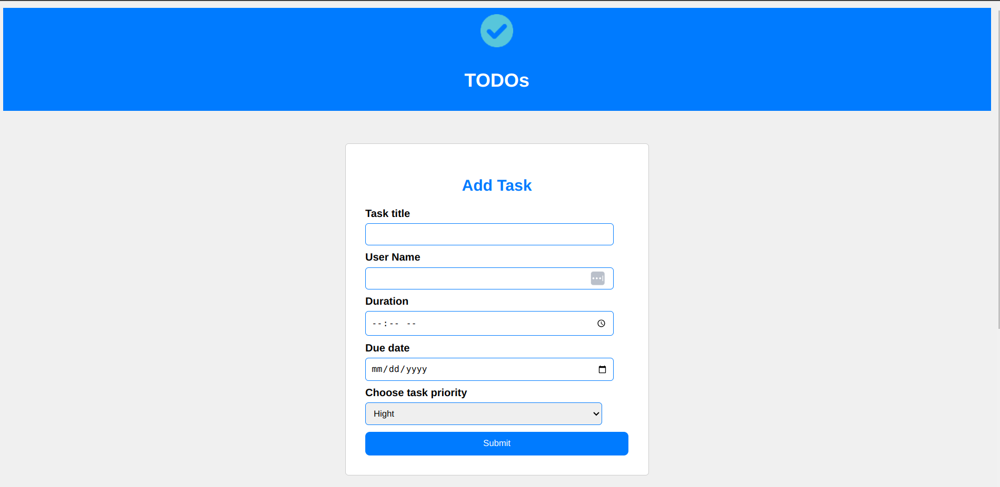

# THE TASKLISTER MINI PROJECT
*****
### Author : Alexander Maina 6 Oct 2024
****
## Project Description
This is a JS mini-project that involves creating a mini tasklister projects that leverages JS event listeners, JS DOM programming and HTML and CSS.
******

## SCREENSHOTS

********
## SetUp Instruction
********
### Requirements
* [HTML](html.com)
* [css]
* [javascript]
* [nodeJS]
* Text editor eg [Visual Studio Code](https://code.visualstudio.com/download)

### Getting Files
* Fork the repo
- Create a new branch in your terminal (git checkout -b improve-feature)
- Install the prerequisites
- Make appropriate changes in file(s)
- stage all the changes (git add .)
- Commit the changes (git commit -am "TaskLister mini project complete")
- Push to the branch (git push origin SA.02:Week2-Code challenge: Task Liste)

## Live Link
* https://maina206.github.io/phase-1-tasklister-mini-project/

*****
## Dependencies
- nodeJS
*****
## Technologies Used
1. HTML
2. CSS
3. JavaScript
*****
## Contact Information
* Email : maina206mwangi@gmail.com
*****
## [License](LICENSE)
MIT License
Copyright (c) 2024 Alexander maina
